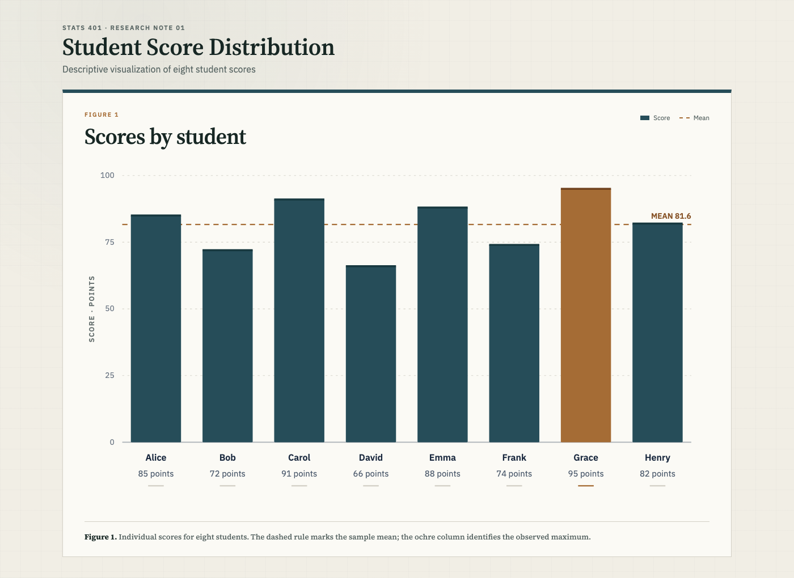

# Lab 1 — Student Score Distribution

## [Open the live interactive visualization →](https://owen-1234.github.io/stats401-labs/lab1/)

This study loads eight observations from [`data/students.csv`](data/students.csv), converts each score from text to a number, and uses D3 data binding to generate an accessible SVG bar chart. Bar height represents score on a 0–100 scale; the dashed reference line marks the sample mean, and the ochre bar identifies the highest observation.

### Implementation

- **HTML:** semantic structure and accessible chart description
- **CSS:** responsive academic publication styling
- **JavaScript and D3:** external CSV loading, row conversion, SVG generation, and data binding
- **Data:** eight course-provided student score records
