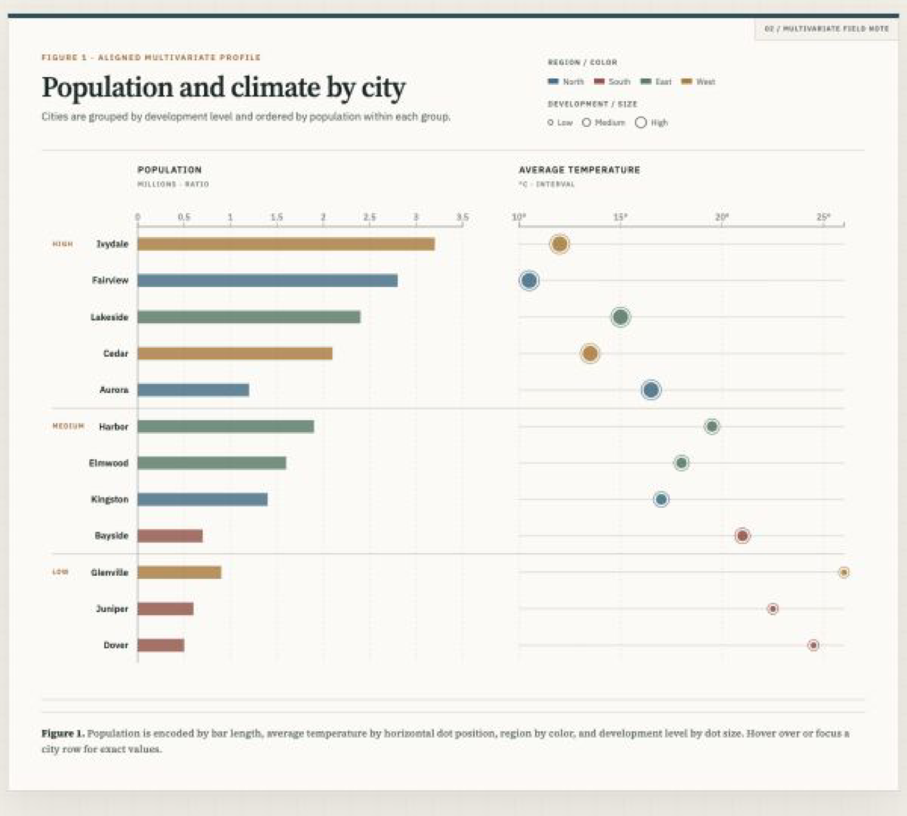

# Lab 2 — Urban Profiles

**Student:** Shilin Ou &middot; **NetID:** so192

## [Open the live interactive visualization →](https://owen-1234.github.io/stats401-labs/lab2/)

This study loads twelve observations from [`../data/cities_multivariate.csv`](../data/cities_multivariate.csv), converts population and temperature from text to numbers, and uses D3 to create an accessible aligned bar-and-dot visualization. Population is represented by bar length, average temperature by horizontal position, region by color, and development level by marker size.

### Implementation

- **HTML:** semantic study structure, encoding legends, figure caption, and a 170-word design justification
- **CSS:** responsive academic publication styling consistent with Lab 1
- **JavaScript and D3:** external CSV loading, numeric row conversion, scales, axes, SVG generation, and keyboard-accessible tooltips
- **Data:** twelve course-provided city records spanning ratio, interval, ordinal, and nominal variables
